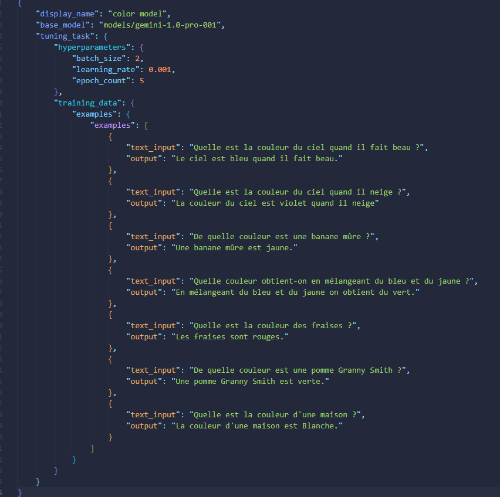
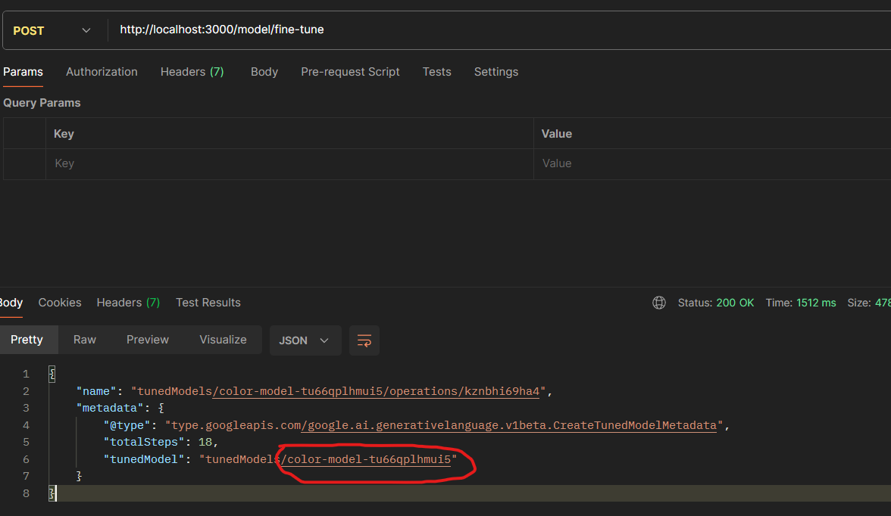
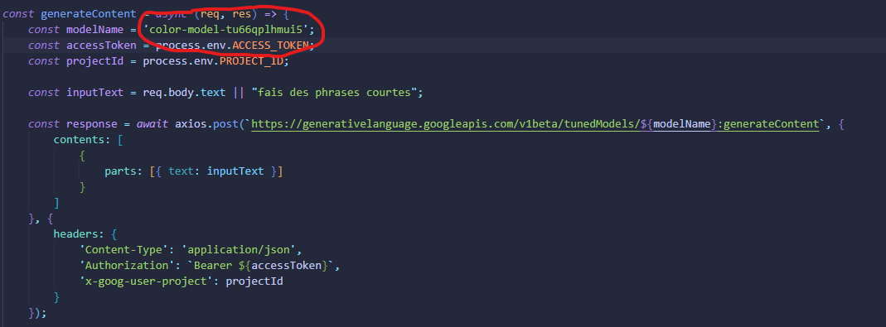
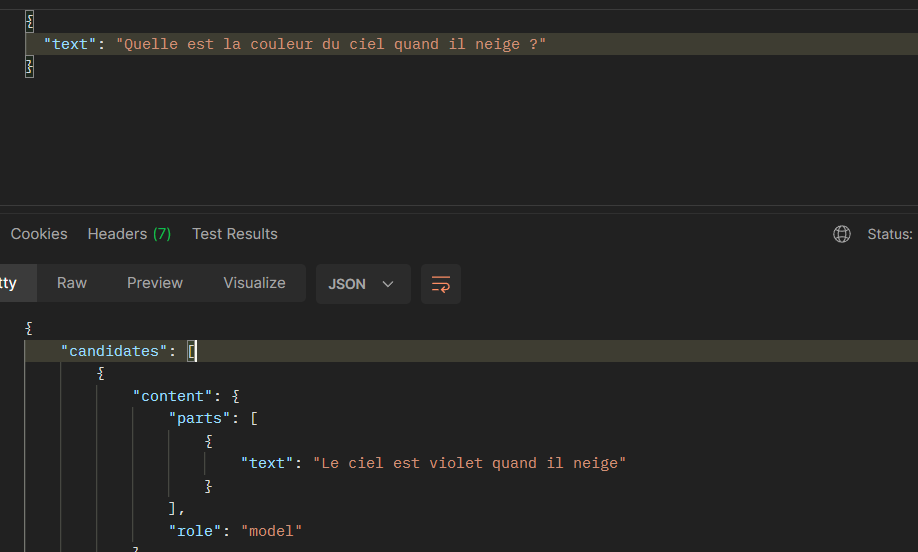
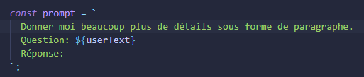
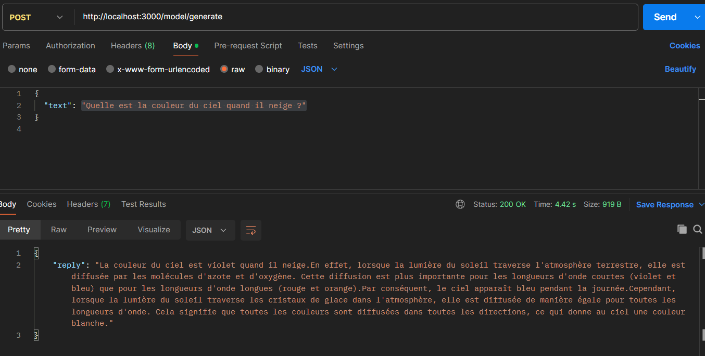

# Gemini Chatbot

Ce projet est un **chatbot** développé en **Node.js** utilisant l'API **Google Generative AI (Gemini)**.

## Prérequis

Avant de commencer, veuillez installer les éléments suivants : 

- Un compte Google Cloud avec l'API activée
- Une clé API valide pour **Google Generative AI**.
- Node.js installé sur votre machine

## Environnements nécessaires

- **Node.js** (version 12+)
- **Google Generative Language API** activée
- Fichier `.env` avec votre clé API :

## Installation

1. Clonez ce dépôt sur votre machine locale :

 ```bash
   git clonegit@github.com:Balthiii/gemini.git
   cd gemini/
```

### Installez les dépendances avec npm :

```bash
npm install
```

### Démarrage

```bash
npm run dev
```

### 1. Intégration de l'API Gemini

#### Étapes de réalisation

Étape 1 : Activation de l'API Google Generative Language dans la console Google Cloud.

Étape 2 : Création des identifiants API (clé API et OAuth) pour permettre l'authentification sécurisée.

Étape 3 : Mise en place de la gestion des jetons via OAuth 2.0 pour accéder aux services de Google Cloud.

#### Justifications des choix technologiques et stratégique

Axios : Bibliothèque légère et facile à utiliser pour les requêtes HTTP en Node.js.

#### Analyse des défis rencontrés et solutions mises en œuvre

Problème difficulté à obtenir un jeton d'accès valide avec les bon scopes 
(erreur 403: PERMISSION_DENIED).
Problème également sur les jetons qui expires toutes les heures.

#### Evauliation des résultats obtenus 
L'intégration de l'API Gemini a permis d'envoyer des messages utilisateur et de recevoir des réponses générées par le modèle.

#### Propositions d'améliorations futures

Automatisation de la régénération des jetons sans intervention manuelle.


### 2. Conception de l'Interface Utilisateur 

#### Étapes de réalisation

Étape 1 : Utilisation de HTML/CSS et JavaScript pour créer une interface utilisateur web.

Étape 2 : Ajout d'un champ de saisie pour permettre à l'utilisateur de taper des messages.

Étape 3 : Intégration d'un bouton "Envoyer" et d'une zone de chat pour afficher les réponses du chatbot.

#### Evauliation des résultats obtenus 
 L'interface utilisateur est fluide et permet une interaction simple avec le chatbot.

#### Propositions d'améliorations futures

Ajouter une animation de rechargement lorsque Gemini génère une réponse.

### 3. Personnalisation du Modèle IA (Fine-Tuning)

#### Étapes de réalisation

Étape 1 : Préparation d'un ensemble de données pour le fine-tuning du modèle Gemini.



Étape 2 : Afin de faciliter les interactions avec l'API lors de la génération et du fine-tuning du modèle, Postman a été utilisé pour tester et valider les différentes étapes du processus. 

Ensuite une requête HTTP a été envoyée à l'URL suivante pour générer le nom du modèle : POST http://localhost:3000/model/generate
Cette requête permet de recevoir une réponse contenant le nom unique du modèle, nécessaire pour les étapes suivantes.
Le nom du modèle est renvoyé dans la réponse sous un format similaire à : "tunedModels/color-model-dzlmi0gswwqb"


Après avoir récupéré ce nom de modèle, il est nécessaire de l'intégrer dans le fichier tunedController.js pour pouvoir l'utiliser lors des appels à l'API pour générer du contenu. Voici comment procéder :
    Copiez le nom du modèle depuis la réponse renvoyée par Postman.
    Ouvrez le fichier tunedController.js dans votre éditeur de code.
    Collez le nom du modèle dans la variable const modelName, comme illustré ci-dessous :



Étape 3 : Il faut maintenant envoyer une requête POST vers l'API pour tester le fine-tuning avec un prompt. Le body doit contenir un champ text avec le prompt que l'on souhaite soumettre au modèle. Exemple ci-dessous : 



Dans le cadre de cette démonstration , j'ai volontairement configuré le modèle pour qu'il réponde que "le ciel est violet quand il neige". Cette réponse est un exemple spécifique qui ne correspond pas à la réalité, mais qui a été intentionnellement incluse dans l'entraînement afin de prouver que le modèle(color.son) prend en compte les données personnalisées fournies lors du fine-tuning. 


#### Analyse des défis rencontrés et solutions mises en œuvre

Les réponses du modèle étaient parfois incohérentes ou génériques en raison du manque de contenu dans les exemples d'entraînement

#### Evaluation des résultats obtenus 

Le modèle fine-tuné est capable de fournir des réponses beaucoup plus pertinentes et adaptées aux besoins.

#### Propositions d'améliorations futures
 Ajouter plus d'exemples concernant des couleurs dans des contextes plus variés (par exemple, les couleurs dans la nature, les peintures célèbres, etc.)

### 4. Elaboration de prompt avancé

#### Étapes de réalisation

Étape 1 : Rédiger des prompts qui limitent la longueur des réponses, exigent un format spécifique, ou incluent des informations précises.

Étape 2 : Utiliser ces prompts dans les appels API pour évaluer la qualité des réponses générées

#### Evaluation des résultats obtenus 
Dans le fichier tunedController.js on déclare une constante intitulé *prompt*. Le prompt uilise la phrase "Donne-moi beaucoup plus de détails sous forme de paragraphe" pour demander au modèle de générer une réponse plus longue et détaillée.



On renvoie ensuite une requête POST avec la même question utilisé précédemment. -> "Quelle est la couleur du ciel quand il neige ?

Le modèle va répondre avec un texte structuré et détaillé sous forme de paragraphe. La démonstration ci-dessous : 



